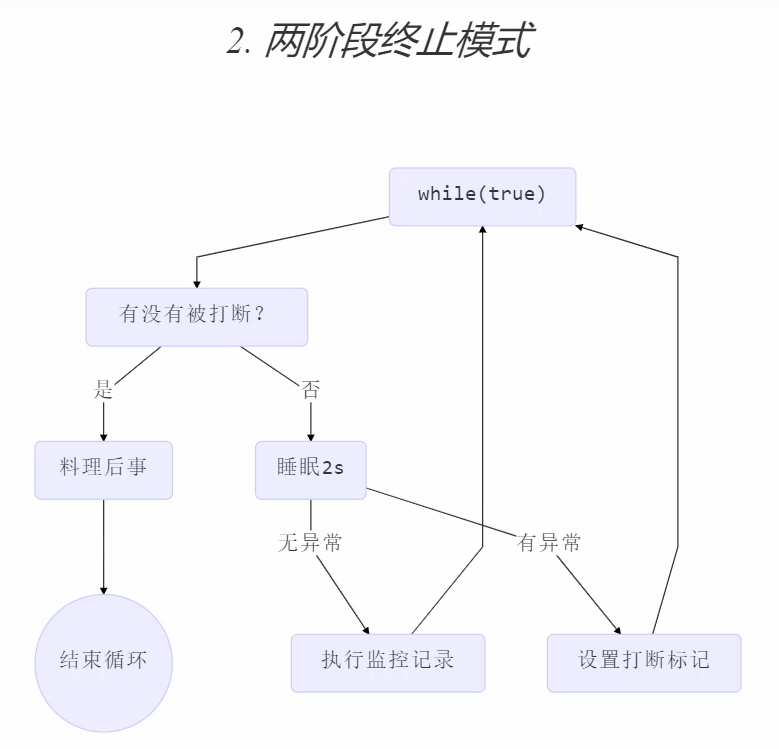

### 线程上下文切换（Thread Context Switch）
因为以下一些原因导致 cpu 不再执行当前的线程，转而执行另一个线程的代码
* 线程的 cpu 时间片用完
* 垃圾回收
* 有更高优先级的线程需要运行
* 线程自己调用了 sleep、yield、wait、join、park、synchronized、lock 等方法

当 Context Switch 发生时，需要由操作系统保存当前线程的状态，并恢复另一个线程的状态，Java 中对应的概念
就是`程序计数器（Program Counter Register)`，它的作用是记住下一条 jvm 指令的执行地址，是线程私有的
* 状态包括程序计数器、虚拟机栈中每个栈帧的信息，如局部变量、操作数栈、返回地址等
* Context Switch 频繁发生会影响性能

### 常见方法
|  方法名   | static  | 功能说明   | 注意  |
|  ----  | ----  |  ----  | ----  |
| start()  |  |启动一个新线程，在新的线程运行 run 方法中的代码| start 方法只是让线程进入就绪，里面代码不一定立刻运行（CPU 的时间片还没分给它）。每个线程对象的start方法只能调用一次，如果调用了多次会出现IllegalThreadStateException |
| run()  |  |新线程启动后会调用的方法  | 如果在构造 Thread 对象时传递了 Runnable 参数，则线程启动后会调用 Runnable 中的 run 方法，否则默认不执行任何操作。但可以创建 Thread 的子类对象，来覆盖默认行为 |
|  join()  |   |  等待调用线程运行结束  |   |
|  join(n)  |   |  等待调用线程运行结束，最多等待 n毫秒  |   |
|  getId()  |   |  获取线程长整型的 id  | id唯一  |
|  getName()  |   |  获取线程名  |   |
|  setName(name)  |   |  修改线程名  |   |
|  getPriority()  |   |  获取线程优先级  |   |
|  setPriority(int)  |   | 修改线程优先级   | java中规定线程优先级是1~10 的整数，较大的优先级能提高该线程被 CPU 调度的机率  |
|  getState()  |   |  获取线程状态  | Java 中线程状态是用 6 个 enum 表示，分别为：NEW, RUNNABLE, BLOCKED, WAITING, TIMED_WAITING, TERMINATED  |
|  isInterrupted()  |   |  判断是否被打断  | `不会清除打断标记`  |
|  isAlive()  |   |  线程是否存活（还没有运行完毕）  |   |
|  interrupt()  |   | 打断线程  | 如果被打断线程正在 sleep，wait，join 会导致被打断的线程抛出 InterruptedException，并`清除打断标记` ；如果打断的正在运行的线程，则会`设置打断标记` ；park 的线程被打断，也会`设置打断标记`  |
|  interrupted()  | static  |  判断当前线程是否被打断  | `会清除打断标记`  |
|  currentThread()  | static  |  获取当前正在执行的线程  |   |
|  sleep(n)  | static  |  让当前执行的线程休眠n毫秒，休眠时让出 cpu 的时间片给其它线程  |   |
|  yield()  | static  |  提示线程调度器让出当前线程对CPU的使用  | 主要是为了测试和调试  |

### sleep 与 yield
#### sleep
* 调用 sleep 会让当前线程从 `Running` 进入 `Timed Waiting` 状态（阻塞）
* 其它线程可以使用 interrupt 方法打断正在睡眠的线程，这时 sleep 方法会抛出 InterruptedException
* 睡眠结束后的线程未必会立刻得到执行
* 建议用 TimeUnit 的 sleep 代替 Thread 的 sleep 来获得更好的可读性
#### yield
* 调用 yield 会让当前线程从 Running 进入 `Runnable` 就绪状态，然后调度执行其它线程
* 具体的实现依赖于操作系统的任务调度器
#### 线程优先级
* 线程优先级会提示（hint）调度器优先调度该线程，但它仅仅是一个提示，调度器可以忽略它
* 如果 cpu 比较忙，那么优先级高的线程会获得更多的时间片，但 cpu 闲时，优先级几乎没作用

参考代码：thread/ThreadDemo6.java

### join
参考代码：ThreadDemo7

### interrupt
#### 打断 sleep，wait，join 的线程
这几个方法都会让线程进入阻塞状态，打断该线程, 会`清空打断状态`
#### 打断正常运行的线程
打断正常运行的线程, 不会清空打断状态
#### 打断park线程
打断 park 线程, 不会清空打断状态

> 上述三点参考代码：ThreadDemo8
#### interrupt 两阶段终止
需求图示： 

> 参考代码：ThreadDemo10

### 不推荐的方法
以下方法是不推荐使用的方法，这些方法已过时，容易破坏同步代码块，造成线程死锁

|  方法名   | static  | 功能说明  |
|  ----  | ----  |  ----  |
|  stop()  |   |  停止线程运行  |
|  suspend()  |   |  挂起（暂停）线程运行  |
|  resume()  |   |  恢复线程运行  |

### 主线程与守护线程
默认情况下，Java 进程需要等待所有线程都运行结束，才会结束。有一种特殊的线程叫做守护线程，只要其它非守
护线程运行结束了，即使守护线程的代码没有执行完，也会强制结束。垃圾回收器线程就是一种守护线程。

### 线程状态
#### 五种状态
这是从`操作系统`层面来描述的
> 线程的五种状态.png

* 【初始状态】仅是在语言层面创建了线程对象，还未与操作系统线程关联
* 【可运行状态】（就绪状态）指该线程已经被创建（与操作系统线程关联），可以由 CPU 调度执行
* 【运行状态】指获取了 CPU 时间片运行中的状态
  * 当 CPU 时间片用完，会从【运行状态】转换至【可运行状态】，会`导致线程的上下文切换`
* 【阻塞状态】
  * 如果调用了阻塞 API，如 BIO 读写文件，这时该线程实际不会用到 CPU，会`导致线程上下文切换`，进入
  【阻塞状态】
  * 等 BIO 操作完毕，会由操作系统唤醒阻塞的线程，转换至【可运行状态】
  * 与【可运行状态】的区别是，对【阻塞状态】的线程来说只要它们一直不唤醒，调度器就一直不会考虑
  调度它们
* 【终止状态】表示线程已经执行完毕，生命周期已经结束，不会再转换为其它状态

#### 六种状态
这是从 Java API 层面来描述的

根据 Thread.State 枚举，分为六种状态：`NEW、RUNNABLE、BLOCKED、WAITING、TIMED_WAITING、TERMINATED`
> 线程的六种状态.png

* 【NEW】线程刚被创建，但是还没有调用 start() 方法
* 【RUNNABLE】 当调用了 start() 方法之后，注意，Java API 层面的 【RUNNABLE】 状态涵盖了 操作系统 层面的
【可运行状态】、【运行状态】和【阻塞状态】（由于 BIO 导致的线程阻塞，在 Java 里无法区分，仍然认为是可运行）
* 【BLOCKED】 ，【WAITING】 ，【TIMED_WAITING】都是 Java API 层面对【阻塞状态】的细分，后面会在状态转换一节
详述
* 【TERMINATED】 当线程代码运行结束
