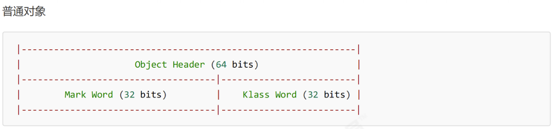
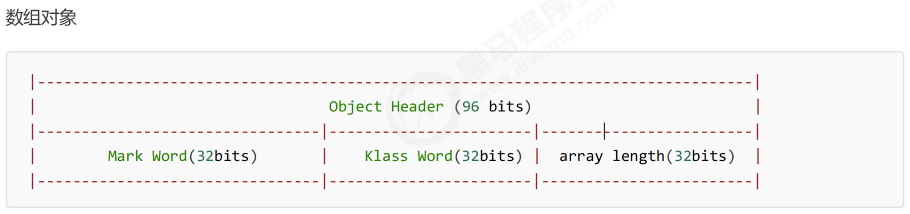
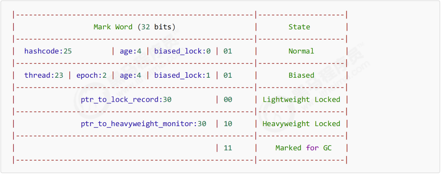
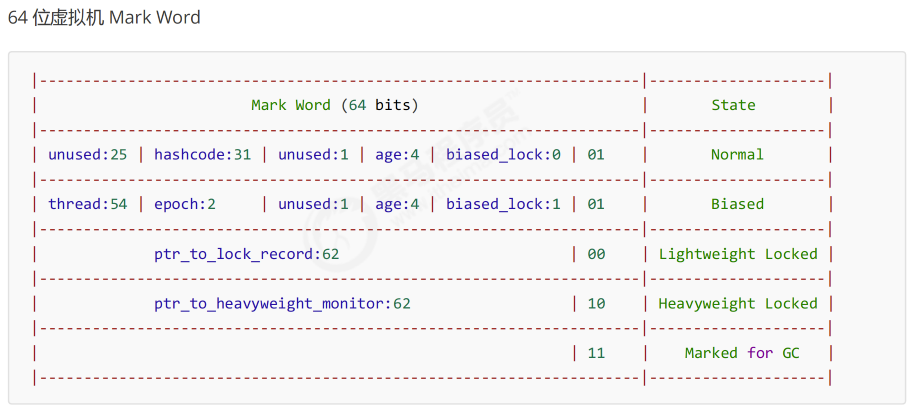
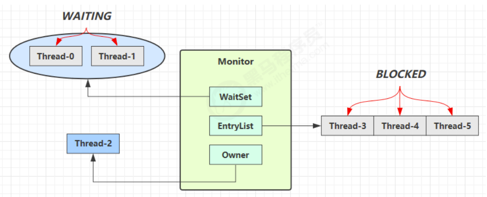
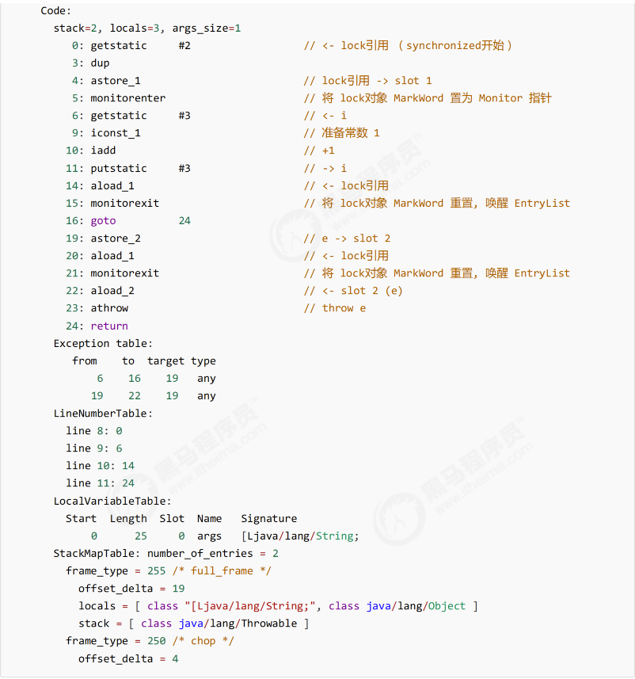
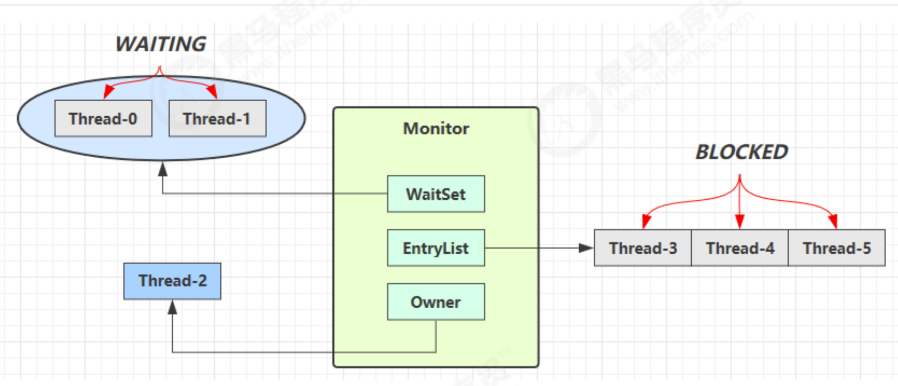
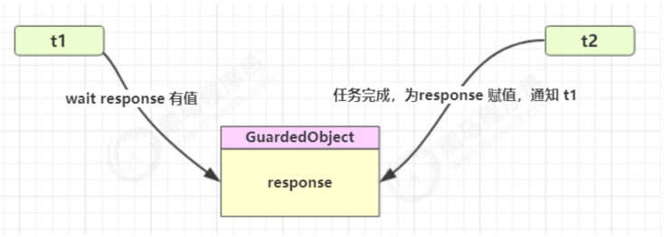
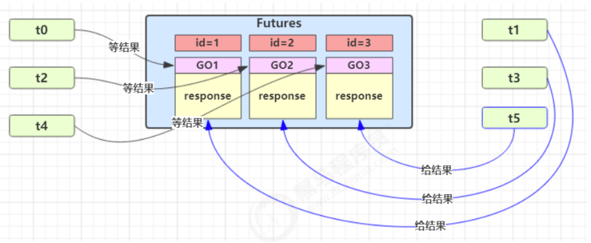

### 临界区（Critical Section）
* 一个程序运行多个线程本身是没有问题的
* 问题出在多个线程访问共享资源
  * 多个线程读共享资源其实也没有问题
  * 在多个线程对共享资源读写操作时发生指令交错，就会出现问题
* 一段代码块内如果存在对共享资源的多线程读写操作，称这段代码块为**临界区**

### 竞态条件（Race Condition）
多个线程在临界区内执行，由于代码的执行序列不同而导致结果无法预测，称之为发生了**竞态条件**

### synchronized
#### 方法上的synchronized
* 对象锁
```java
class Test {
    public synchronized void test() {}
}
```
等价于
```java
class Test {
    public void test() {
        synchronized(this) {}
    }
}
```
* 类锁
```java
class Test {
    public synchronized static void test() {}
}
```
等价于
```java
class Test {
    public static void test() {
        synchronized (Test.class) {}
    }
}
```
### 变量的线程安全分析
#### 成员变量和静态变量是否线程安全？
* 如果他们没有共享，则线程安全
* 如果他们被共享了，根据他们的状态是否能够改变，又分成两种情况：
  * 如果只有读操作，则线程安全
  * 如果有读写操作，则这段代码是临界区，需要考虑线程安全
#### 局部变量是否线程安全？
* 局部变量是线程安全的
* 但局部变量引用的对象则未必
  * 如果该对象没有逃离方法的作用范围，它是线程安全的
  * 如果该对象逃离方法的作用范围，需要考虑线程安全
<br/>
参考代码：ThreadUnsafe.java | ThreadSafe.java

#### 常见线程安全类
* String
* Integer
* StringBuffer
* Random
* Vector
* HashTable
* java.util.concurrent包下的类
<br/>
Note：这里说它们是线程安全的是指，多个线程调用他们同一个实例的某一个方法时，是线程安全的。
> 其中，String、Integer等都是不可变类，因为其内部的状态不可以改变

### Monitor概念
#### Java 对象头
* 以32位虚拟机为例
<br/>

普通对象



数组对象



<br/>

Mark Word在32位虚拟机的结构为：



Mark Word在64位虚拟机的结构为：



#### Monitor原理
Monitor 被翻译为**监管器** 或者 **管程**

每个Java对象都可以关联一个Monitor对象，如果使用synchronized给对象上锁（重量级）之后，
该对象头的Mark Down中就被设置指向Monitor对象的指针。

Monitor结构如下



* 刚开始Monitor中Owner为null
* 当Thread-2执行synchronized(obj)就会将Monitor的所有者Owner置为Thread-2，Monitor中只能有一个Owner
* 在Thread-2上锁过程中，如果Thread-3、Thread-4、Thread-5也来执行synchronized(obj)，就会进入EntryList队列中，状态为BLOCKED
* Thread-2执行完同步代码块的内容，然后唤醒EntryList中等待的线程来竞争锁，竞争锁的时候是非公平的。
* 图中WaitSet中的Thread-0，Thread-1是之前获得过锁，但条件不满足进入了WAITING状态的线程，比如说线程调用wait时。

> Note
> 1) synchronized必须是进入同一个对象的Monitor才有上述效果
> 2) 不加synchronized的对象不会关联Monitor对象，所以不遵从上述规则

#### Synchronized 原理
```java
public class Test {
  static final Object lock = new Object();
  static int counter = 0;
  public static void main(String[] args) {
    synchronized (lock) {
      counter++;
    }
  }
}
```
对应的字节码为：



>Node:
> 方法级别的synchronized不会在字节码指令中有所体现

#### synchronized 原理进阶
看单篇介绍

### wait notify
#### API 介绍
* obj.wait() 让进入object Monitor的线程 到 WaitSet中等待
* obj.notify() 在 object 上正在waitSet等待的线程中挑一个唤醒
* obj.notifyAll() 让object上正在waitSet等待的线程全部唤醒

参考代码：thread.ThreadDemo17

wait、notify都是线程之间进行协作的手段，都属于Object对象的方法，**必须获得此对象的锁，才能调用这几个方法**
* wait()方法会释放对象的锁，进入WaitSet等待区，从而让其他线程有机会获得对象的锁。其会无限制等待，知道notify唤醒为止
* wait(long n) 有时限的等待，到n毫秒后结束等待，或是被notify

#### notify、wait 原理

* Owner线程发现条件不满足，调用wait方法，即可进入WaitSet，变为WAITING状态
* BLOCKED和WAITING的线程都处于阻塞状态，不占用CPU时间片
* BLOCKED线程会在OWNER线程释放锁时唤醒
* WAITING线程会在OWNER线程调用notify或者notifyAll时唤醒，但唤醒后并不意味着立刻获得锁，仍需进入EntryList重新竞争

#### sleep(n) 和 wait(n)的区别
* sleep 是 Thread方法，而wait是Object的方法
* sleep 不需要强制和synchronized配合使用，但wait需要和synchronized一起用
* sleep在睡眠的同时，不会释放对象锁，但wait在等待的时候会释放对象锁
* 他们状态都是TIMED_WAITING

#### 保护性暂停
保护性暂停，即Guarded Suspension，用在一个线程等待另外一个线程的执行结果

要点：
* 有一个结果需要从一个线程传递到另一个线程，让他们关联同一个GuardedObject
* 如果有结果不断从一个线程到另一个线程，那么就可以使用消息队列（即生产者消费者模式）
* JDK中，join的实现、Future的实现，采用的就是此模式
* 因为要等待另一方的结果，因此归类到同步模式

场景一：

参考代码：ThreadDemo13.java

场景二：多任务版GuardedObject

下图中 Futures 就好比居民楼一层的信箱（每个信箱有房间编号），左侧的 t0，t2，t4 就好比等待邮件的居民，右
侧的 t1，t3，t5 就好比邮递员

如果需要在多个类之间使用 GuardedObject 对象，作为参数传递不是很方便，因此设计一个用来解耦的中间类，
这样不仅能够解耦【结果等待者】和【结果生产者】，还能够同时支持多个任务的管理

参考代码：ThreadDemo14.java

#### 生产者消费者
参考代码：ThreadDemo15.java

### Join原理
```shell
t1.join() 
-->
synchnorized(t1) {
  // 调用者线程进入 t1 的 waitSet 等待, 直到 t1 运行结束
  // A thread is alive if it has been started and has not yet died
  while (t1.isAlive()) {
    t1.wait(0);
  }
}
```

> Note
> 
> Join体现的是【保护性暂停】 

### Park & UnPark
详见 Park&UnPark.md

### 线程状态转换
详见 线程状态转换理解.md

### 活跃性
#### 死锁
#### 活锁
#### 饥饿
参考代码：thread.ThreadDemo19

### ReentrantLock
详见 ReentrantLock介绍.md

