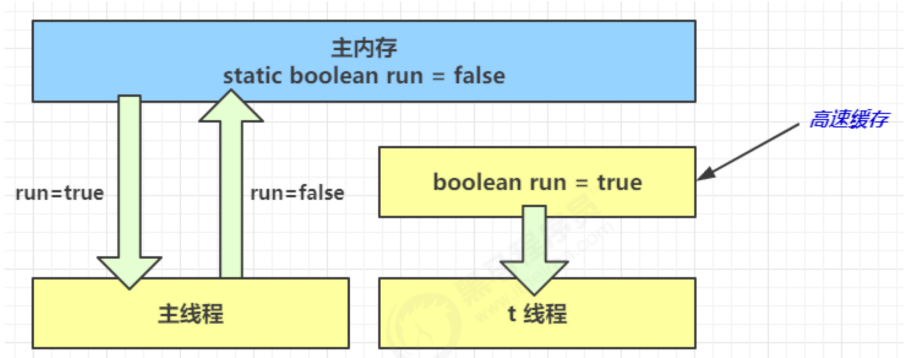

### Java 内存模型
JMM 即 `Java Memory Model`，它定义了主存、工作内存抽象概念，
底层对应着CPU寄存器、缓存、硬件内存、CPU指令优化等。

JMM体现在以下几个方面：
* 原子性 - 保证指令不会受到线程上下文切换的影响
* 可见行 - 保证指令不会受CPU缓存的影响
* 有序性 - 保证指令不会受CPU指令并行优化的影响

### 可见行
先看一个现象，main线程对run变量的修改对于t线程不可见，导致了t线程无法停止：
```java
public class Demo1 {
    static boolean run = true;
    public static void main(String[] args) throws InterruptedException {

        final Thread t1 = new Thread(() -> {
            while (run) {

            }
        });

        t1.start();

        TimeUnit.SECONDS.sleep(1);

        run = false;
    }
}
```

原因分析：
* 初始状态，t线程刚开始从主内存读取了run的值到工作内存.
* 因为t线程要频繁从主内存中读取run的值，JIT编译器（即时编译器）会将run的值缓存到自己工作内存中的高速缓存中，
  减少对主存中run的访问，提高效率。
* 1s 之后，main线程修改了run的值，并同步至主存，而t线程是从自己工作内存中的高速缓存中读取这个变量的值，结果永远是旧值。


问题解决

`volatile`

* 可以用来修饰成员变量和静态成员变量
* 可以避免线程从自己的工作缓存中查找变量的值，必须到主存中获取它的值，线程操作volatile变量都是直接操作主存

### 原子性 VS 可见行
可见性，它保证的是在多个线程之间，一个线程对 `volatile` 变量的修改对另一个线程可
见， 不能保证原子性，**仅用在一个写线程，多个读线程的情况**

* `synchronized` 语句块既可以保证代码块的原子性，也同时保证代码块内变量的可见性。但缺点是
`synchronized` 是属于重量级操作，性能相对更低。
* 如果在可见行示例的死循环中加入 `System.out.println()`，会发现即使不加 volatile 修饰符，线程 t 也能正确看到
对 run 变量的修改了，想一想为什么？
  * 详见文章：**System.out.println()保证变量的可见行.md**
  
#### volatile 原理
详见文章：
* **内存屏障.md**
* **volatile 原理.md**
