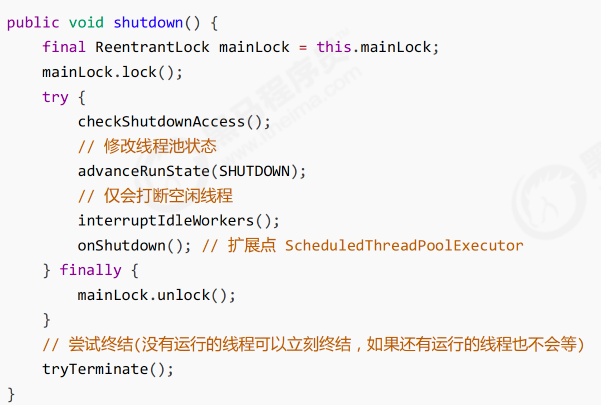
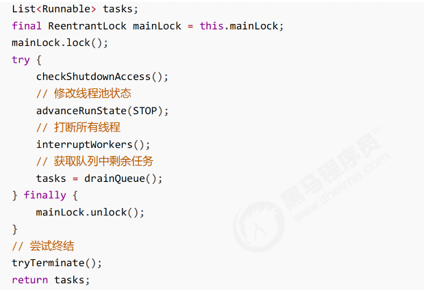

## 线程池
### 自定义线程池


参考代码：TestPool.java

### ThreadPoolExecutor

#### 线程池状态
ThreadPoolExecutor 使用 int 的高 3 位来表示线程池状态，低 29 位表示线程数量。

> 为什么ThreadPoolExecutor会将线程池状态以及线程数据放到一个变量里，而不是单独的两个变量？
> 
> 这些信息存储在一个原子变量 ctl 中，目的是将线程池状态与线程个数合二为一，这样就可以用一次 cas 原子操作
> 进行赋值
> ```text
> private final AtomicInteger ctl = new AtomicInteger(ctlOf(RUNNING, 0));
> // c 为旧值， ctlOf 返回结果为新值
> ctl.compareAndSet(c, ctlOf(targetState, workerCountOf(c))));
> // rs 为高 3 位代表线程池状态， wc 为低 29 位代表线程个数，ctl 是合并它们
> private static int ctlOf(int rs, int wc) { return rs | wc; }
> ```

#### 构造方法
```text
public ThreadPoolExecutor(int corePoolSize,
                          int maximumPoolSize, 
                          long keepAliveTime, 
                          TimeUnit unit,
                          BlockingQueue<Runnable> workQueue, 
                          ThreadFactory threadFactory, 
                          RejectedExecutionHandler handler)
```
* corePoolSize 核心线程数目 (最多保留的线程数)
* maximumPoolSize 最大线程数目
* keepAliveTime 生存时间 - 针对救急线程
* unit 时间单位 - 针对救急线程
* workQueue 阻塞队列
* threadFactory 线程工厂 - 可以为线程创建时起个好名字
* handler 拒绝策略

##### 工作方式
* 线程池中刚开始没有线程，当一个任务提交给线程池后，线程池会创建一个新线程来执行任务。
* 当线程数达到 corePoolSize 并没有线程空闲，这时再加入任务，新加的任务会被加入workQueue 队列排
队，直到有空闲的线程。
* 如果队列选择了有界队列，那么任务超过了队列大小时，会创建 maximumPoolSize - corePoolSize 数目的线
程来救急。
* 如果线程到达 maximumPoolSize 仍然有新任务这时会执行拒绝策略。拒绝策略 jdk 提供了 4 种实现，其它
著名框架也提供了实现
  * AbortPolicy 让调用者抛出 RejectedExecutionException 异常，这是默认策略
  * CallerRunsPolicy 让调用者运行任务
  * DiscardPolicy 放弃本次任务
  * DiscardOldestPolicy 放弃队列中最早的任务，本任务取而代之
  * Dubbo 的实现，在抛出 RejectedExecutionException 异常之前会记录日志，并 dump 线程栈信息，方便定位问题
  * Netty 的实现，是创建一个新线程来执行任务
  * ActiveMQ 的实现，带超时等待（60s）尝试放入队列，类似我们之前自定义的拒绝策略
  * PinPoint 的实现，它使用了一个拒绝策略链，会逐一尝试策略链中每种拒绝策略
* 当高峰过去后，超过corePoolSize 的救急线程如果一段时间没有任务做，需要结束节省资源，这个时间由
  keepAliveTime 和 unit 来控制。

#### newFixedThreadPool
```text
public static ExecutorService newFixedThreadPool(int nThreads) { 
    return new ThreadPoolExecutor(nThreads, nThreads,
                                  0L, TimeUnit.MILLISECONDS,
                                  new LinkedBlockingQueue<Runnable>());
}
```
* 核心线程数 == 最大线程数（没有救急线程被创建），因此也无需超时时间
* 阻塞队列是无界的，可以放任意数量的任务
> 适用于任务量已知，相对耗时的任务

#### newCachedThreadPool
```text
public static ExecutorService newCachedThreadPool() { 
    return new ThreadPoolExecutor(0, Integer.MAX_VALUE,
                                  60L, TimeUnit.SECONDS,
                                  new SynchronousQueue<Runnable>());
}
```
* 核心线程数是 0， 最大线程数是 Integer.MAX_VALUE，救急线程的空闲生存时间是 60s，意味着
  * 全部都是救急线程（60s 后可以回收）
  * 救急线程可以无限创建
* 队列采用了 SynchronousQueue 实现特点是，它没有容量，没有线程来取是放不进去的（一手交钱、一手交货）
  * 参考代码：SynchronousQueueTest.java 
> 整个线程池表现为线程数会根据任务量不断增长，没有上限，当任务执行完毕，空闲一分钟后释放线程。
> 适合任务书比较密集，但每个任务执行时间较短的情况。

#### newSingleThreadExecutor
```text
public static ExecutorService newSingleThreadExecutor() { 
    return new FinalizableDelegatedExecutorService
        (new ThreadPoolExecutor(1, 1,
                                0L, TimeUnit.MILLISECONDS,
                                new LinkedBlockingQueue<Runnable>()));
}
```
* 使用场景
  * 希望多个任务排队执行。线程数固定为 1，任务数多于 1 时，会放入无界队列排队。任务执行完毕，这唯一的线程
    也不会被释放。
* 区别
  * 自己创建一个单线程串行执行任务，如果任务执行失败而终止那么没有任何补救措施，而线程池还会新建一
    个线程，保证池的正常工作
  * Executors.newSingleThreadExecutor() 线程个数始终为1，不能修改
    * FinalizableDelegatedExecutorService 应用的是装饰器模式，只对外暴露了 ExecutorService 接口，因
    此不能调用 ThreadPoolExecutor 中特有的方法
  * Executors.newFixedThreadPool(1) 初始时为1，以后还可以修改
    * 对外暴露的是 ThreadPoolExecutor 对象，可以强转后调用 setCorePoolSize 等方法进行修改

#### 提交任务
参考代码：SubmitTaskTest.java

#### 关闭线程池
* shutdown 
  * 特点：
    * 线程池状态变为 SHUTDOWN
      * 不会接受新的任务
      * 但已提交任务会执行完
      * 此方法不会阻塞调用线程的执行
  * 源码：
  * 参考代码：ShutdownTest.java
* shutdownNow
  * 特点：
    * 线程池状态变为 STOP
      * 不会接受新任务
      * 会将队列中的任务返回
      * 并用interrupt的方式中断正在执行的任务
  * 源码：
  * 参考代码：ShutdownNowTest.java
* 其他方法
  * 不在 RUNNING 状态的线程池，此方法就返回 true
    * boolean isShutdown();
  * 线程池状态是否是 TERMINATED
    * boolean isTerminated();
  * 调用 shutdown 后，由于调用线程并不会等待所有任务运行结束，因此如果它想在线程池 TERMINATED 后做些事
    情，可以利用此方法等待
    * boolean awaitTermination(long timeout, TimeUnit unit) throws InterruptedException;
  
#### 异步模式之工作线程
##### 定义
让有限的工作线程（Worker Thread）来轮流异步处理无限多的任务。
也可以将其归类为分工模式，它的典型实现就是线程池，也体现了经典设计模式中的享元模式。

例如，海底捞的服务员（线程），轮流处理每位客人的点餐（任务），如果为每位客人都配一名专属的服务员，那
么成本就太高了（对比另一种多线程设计模式：Thread-Per-Message）

注意，不同任务类型应该使用不同的线程池，这样能够避免饥饿，并能提升效率

例如，如果一个餐馆的工人既要招呼客人（任务类型A），又要到后厨做菜（任务类型B）显然效率不咋地，分成
服务员（线程池A）与厨师（线程池B）更为合理，当然你能想到更细致的分工。
##### 饥饿
固定大小线程池会有饥饿现象
* 两个工人是同一个线程池中的两个线程
* 他们要做的事情是：为客人点餐和到后厨做菜，这是两个阶段的工作
  * 客人点餐：必须先点完餐，等菜做好，上菜，在此期间处理点餐的工人必须等待
  * 后厨做菜：没啥说的，做就是了
* 比如工人A 处理了点餐任务，接下来它要等着 工人B 把菜做好，然后上菜，他俩也配合的蛮好
* 但现在同时来了两个客人，这个时候工人A 和工人B 都去处理点餐了，这时没人做饭了，饥饿

参考代码：TestStarvation.java
##### 创建多少线程池合适
* 过小会导致程序不能充分地利用系统资源、容易导致饥饿
* 过大会导致更多的线程上下文切换，占用更多内存
###### CPU 密集型运算
通常采用 `cpu 核数 + 1` 能够实现最优的 CPU 利用率。`+1` 是保证当线程由于页缺失故障（操作系统）或其它原因
导致暂停时，额外的这个线程就能顶上去，保证 CPU 时钟周期不被浪费
###### I/O 密集型运算
CPU 不总是处于繁忙状态，例如，当你执行业务计算时，这时候会使用 CPU 资源，但当你执行 I/O 操作时、远程 RPC 调用时，包括进行数据库操作时，
这时候 CPU 就闲下来了，你可以利用多线程提高它的利用率。
* 经验公式如下:<br/>
  `线程数 = 核数 * 期望 CPU 利用率 * 总时间(CPU计算时间+等待时间) / CPU 计算时间`
1) 例如 4 核 CPU 计算时间是 50% ，其它等待时间是 50%，期望 cpu 被 100% 利用，套用公式:
  4 * 100% * 100% / 50% = 8
2) 例如 4 核 CPU 计算时间是 10% ，其它等待时间是 90%，期望 cpu 被 100% 利用，套用公式
  4 * 100% * 100% / 10% = 40

#### 任务调度线程池
在『任务调度线程池』功能加入之前，可以使用 java.util.Timer 来实现定时功能，Timer 的优点在于简单易用，但
由于所有任务都是由同一个线程来调度，因此所有任务都是串行执行的，同一时间只能有一个任务在执行，前一个
任务的延迟或异常都将会影响到之后的任务。<br/>
参考代码；TimerTaskTest.java<br/>
使用ScheduleExecutorService改写<br/>
参考代码：ScheduleExecutorServiceTest.java
> ScheduleExecutorService整个线程池表现为：
> 线程数固定，任务数多于线程数时，会放入无界队列排队。任务执行完毕，这些线
> 程也不会被释放。用来执行延迟或反复执行的任务
#### 正确处理任务异常
* 主动捉异常<br/>
* 使用Future<br/>
  参考代码：ExceptionCaptureTest.java

#### 定时任务
参考代码：PeriodExecuteTest.java

### Fork/Join
#### 概念
Fork/Join 是 JDK 1.7 加入的新的线程池实现，它体现的是一种**分治思想**，适用于`能够进行任务拆分的 cpu 密集型运算`<br/>

所谓的任务拆分，是将一个大任务拆分为算法上相同的小任务，直至不能拆分可以直接求解。跟递归相关的一些计算，如归并排序、斐波那契数列、都可以用分治思想进行求解<br/>

Fork/Join 在分治的基础上加入了多线程，可以把每个任务的分解和合并交给不同的线程来完成，进一步提升了运算效率<br/>

**Fork/Join 默认会创建与 cpu 核心数大小相同的线程池**

#### 使用
提交给 Fork/Join 线程池的任务需要继承 RecursiveTask（有返回值）或 RecursiveAction（没有返回值）。

例如下面定义了一个对 1~n 之间的整数求和的任务<br/>
参考代码：CalAddNumTest1.java

## JUC
### AQS 原理
### ReentrantLock原理
### 读写锁
#### ReentrantReadWriteLock
参考代码：<br/>
##### 注意事项
* 读锁不支持条件变量
* 升级
* 降级

##### ReentrantReadWriteLock 应用
参考代码：

##### ReentrantReadWriteLock 原理

#### StampedLock
