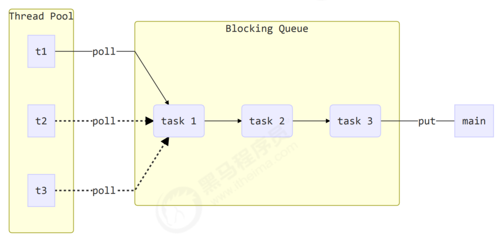
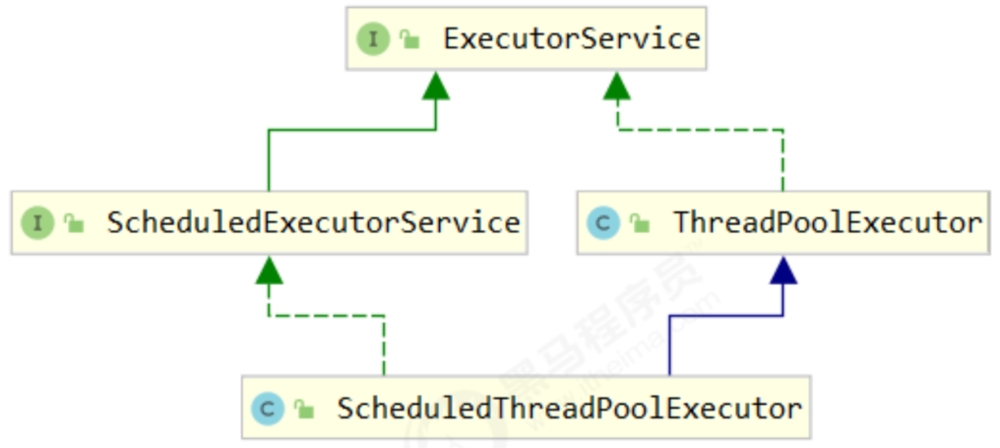
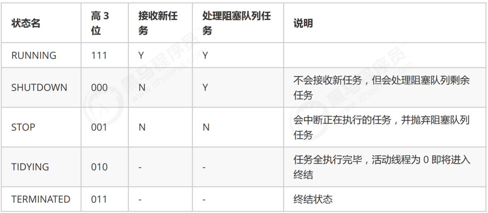
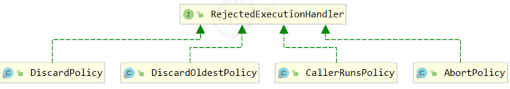

## 线程池
### 自定义线程池
参考代码：TestPool.java


### ThreadPoolExecutor

#### 线程池状态
ThreadPoolExecutor 使用 int 的高 3 位来表示线程池状态，低 29 位表示线程数量。

> 为什么ThreadPoolExecutor会将线程池状态以及线程数据放到一个变量里，而不是单独的两个变量？
> 
> 这些信息存储在一个原子变量 ctl 中，目的是将线程池状态与线程个数合二为一，这样就可以用一次 cas 原子操作
> 进行赋值
> ```text
> private final AtomicInteger ctl = new AtomicInteger(ctlOf(RUNNING, 0));
> // c 为旧值， ctlOf 返回结果为新值
> ctl.compareAndSet(c, ctlOf(targetState, workerCountOf(c))));
> // rs 为高 3 位代表线程池状态， wc 为低 29 位代表线程个数，ctl 是合并它们
> private static int ctlOf(int rs, int wc) { return rs | wc; }
> ```

#### 构造方法
```text
public ThreadPoolExecutor(int corePoolSize,
                          int maximumPoolSize, 
                          long keepAliveTime, 
                          TimeUnit unit,
                          BlockingQueue<Runnable> workQueue, 
                          ThreadFactory threadFactory, 
                          RejectedExecutionHandler handler)
```
* corePoolSize 核心线程数目 (最多保留的线程数)
* maximumPoolSize 最大线程数目
* keepAliveTime 生存时间 - 针对救急线程
* unit 时间单位 - 针对救急线程
* workQueue 阻塞队列
* threadFactory 线程工厂 - 可以为线程创建时起个好名字
* handler 拒绝策略

##### 工作方式
* 线程池中刚开始没有线程，当一个任务提交给线程池后，线程池会创建一个新线程来执行任务。
* 当线程数达到 corePoolSize 并没有线程空闲，这时再加入任务，新加的任务会被加入workQueue 队列排
队，直到有空闲的线程。
* 如果队列选择了有界队列，那么任务超过了队列大小时，会创建 maximumPoolSize - corePoolSize 数目的线
程来救急。
* 如果线程到达 maximumPoolSize 仍然有新任务这时会执行拒绝策略。拒绝策略 jdk 提供了 4 种实现，其它
著名框架也提供了实现
  * AbortPolicy 让调用者抛出 RejectedExecutionException 异常，这是默认策略
  * CallerRunsPolicy 让调用者运行任务
  * DiscardPolicy 放弃本次任务
  * DiscardOldestPolicy 放弃队列中最早的任务，本任务取而代之
  * Dubbo 的实现，在抛出 RejectedExecutionException 异常之前会记录日志，并 dump 线程栈信息，方便定位问题
  * Netty 的实现，是创建一个新线程来执行任务
  * ActiveMQ 的实现，带超时等待（60s）尝试放入队列，类似我们之前自定义的拒绝策略
  * PinPoint 的实现，它使用了一个拒绝策略链，会逐一尝试策略链中每种拒绝策略
* 当高峰过去后，超过corePoolSize 的救急线程如果一段时间没有任务做，需要结束节省资源，这个时间由
  keepAliveTime 和 unit 来控制。

#### newFixedThreadPool
```text
public static ExecutorService newFixedThreadPool(int nThreads) { 
    return new ThreadPoolExecutor(nThreads, nThreads,
                                  0L, TimeUnit.MILLISECONDS,
                                  new LinkedBlockingQueue<Runnable>());
}
```
* 核心线程数 == 最大线程数（没有救急线程被创建），因此也无需超时时间
* 阻塞队列是无界的，可以放任意数量的任务
> 适用于任务量已知，相对耗时的任务