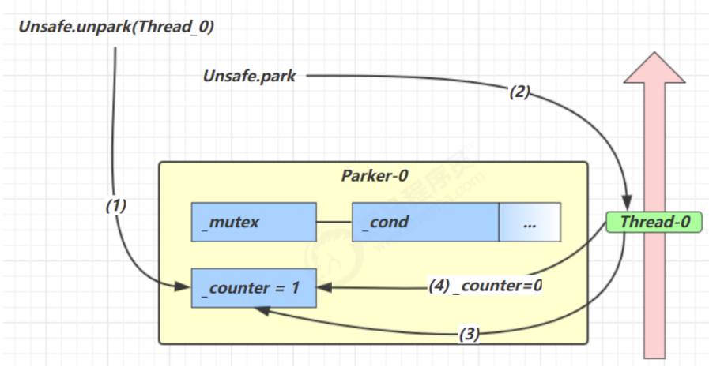

## Park & UnPark
### 基本使用
`park()` 和 `unpark()`是`LockSupport`类中的方法
```text
// 暂停当前线程
LockSupport.park()
// 恢复某个线程的运行
LockSupport.unpark(暂停线程对象);
```
参考代码：ThreadDemo16.java

### 与Object的wait和notify相比
* wait、notify和notifyAll必须配合Object Monitor一起食用，而park、unpark不必
* park & unpark是以线程为单位来【阻塞】和【唤醒】线程，而notify只能随机唤醒一个等待线程，
  notifyAll是唤醒所有等待线程，就不那么【精确】
* park & unpark可以先unpark，而wait & notify 不能先notify

### park & unpark 原理
每一个线程都有自己的`Parker`对象，由三部分组成`_counter`，`_cond`，`_mutex`三部分组成。

通过比喻来解释该park & unpark原理
* 线程就像一个旅人，Parker 就像他随身携带的背包，条件变量就好比背包中的帐篷。_counter 就好比背包中
  的备用干粮（0 为耗尽，1 为充足）
* 调用 park 就是要看需不需要停下来歇息
  * 如果备用干粮耗尽，那么钻进帐篷歇息
  * 如果备用干粮充足，那么不需停留，继续前进
* 调用 unpark，就好比令干粮充足
  * 如果这时线程还在帐篷，就唤醒让他继续前进
  * 如果这时线程还在运行，那么下次他调用 park 时，仅是消耗掉备用干粮，不需停留继续前进
    * 因为背包空间有限，多次调用 unpark 仅会补充一份备用干粮

场景一：先调用park后调用unpark

.png)

1) 当前线程调用Unsafe.park()方法
2) 检查_counter，本情况为0，这时，获得_mutex互斥锁
3) 线程进入_cond条件变量进行阻塞
4) 设置_counter = 0

.png)
1) 调用Unsafe.unpark(Thread_0)方法，设置_counter为1
2) 唤醒_cond条件变量中的Thread_0
3) Thread_0恢复执行
4) 设置_counter为0

场景二：先调用unpark在调用park


1) 调用Unsafe.unpark(Thread_0)方法，设置_counter为1
2) 当前线程调用Unsafe.park()方法
3) 检查_counter，本情况为1，这时线程无阻塞，继续运行
4) 设置_counter为0