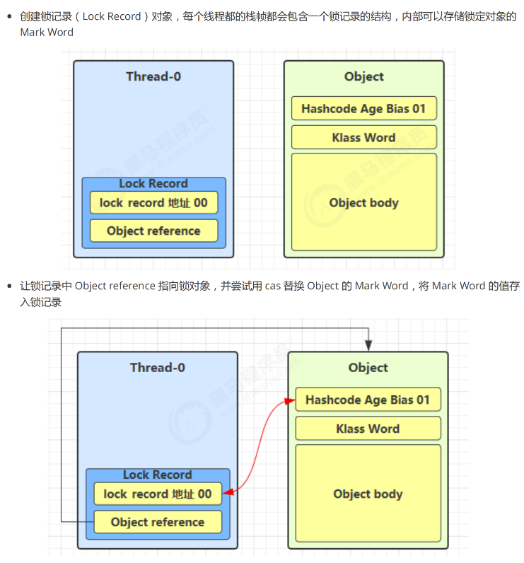
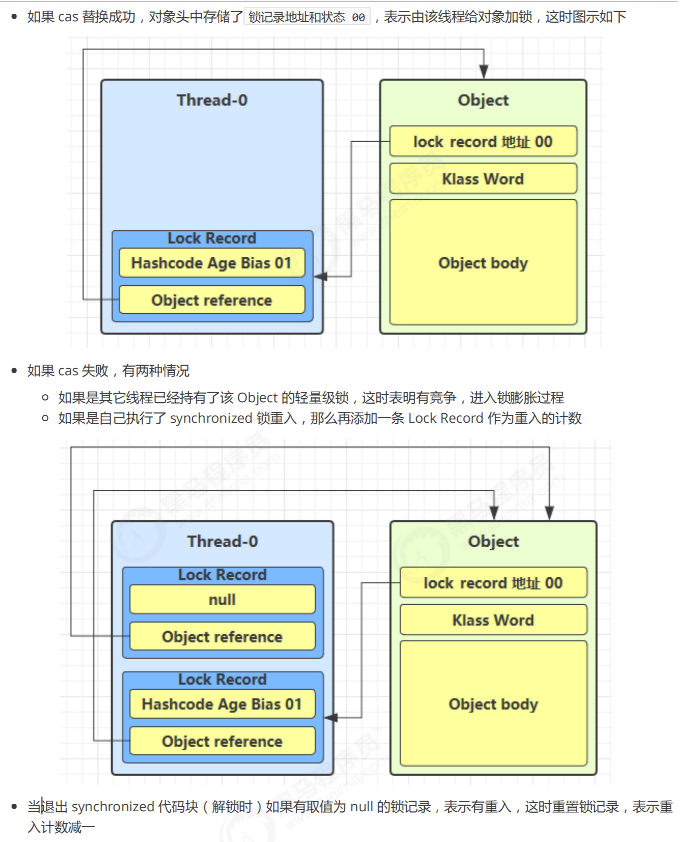
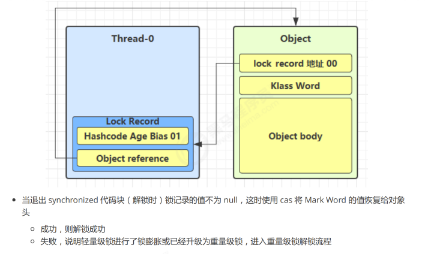
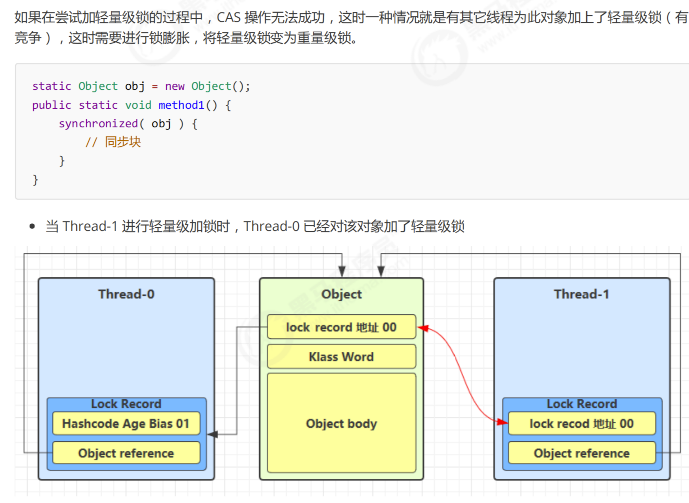
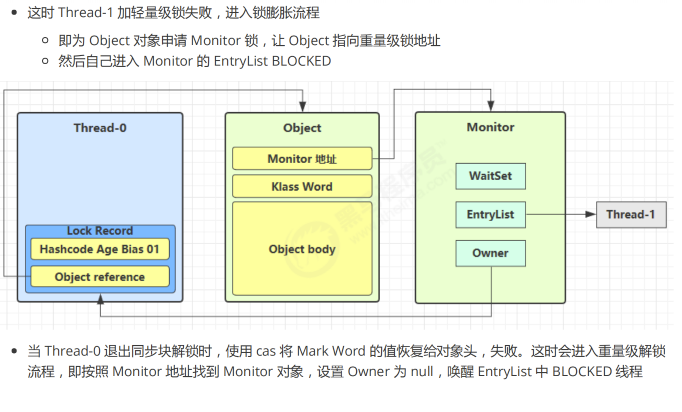
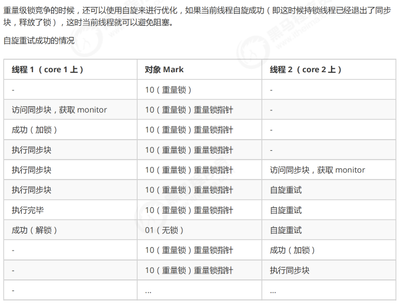
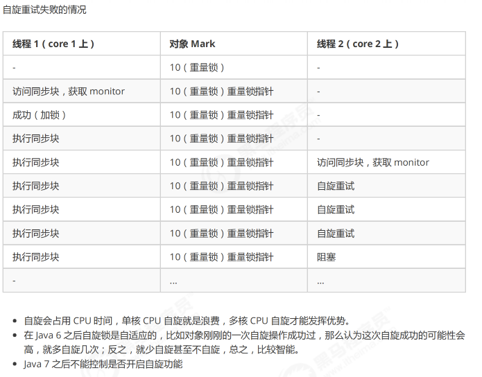
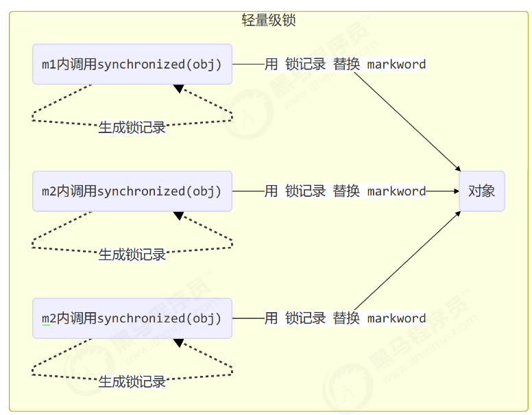
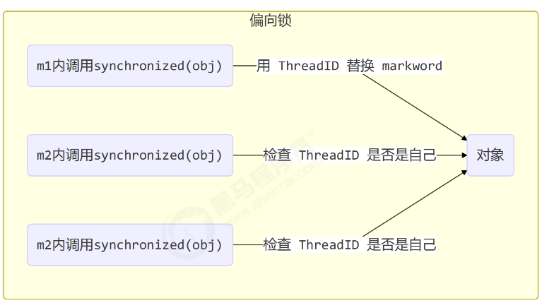

## synchronized 原理进阶

### 轻量级锁

轻量级锁的使用场景：如果一个对象虽然有多线程要加锁，但加锁的时间是错开的（也就是没有竞争），那么可以使用轻量级锁来优化。

轻量级锁对使用者来说是透明的，即语法仍然是synchronized。

假设有两个方法同步块，利用同一个对象进行加锁

```java
public class Test {
    static final Object obj = new Object();

    public static void method1() {
        synchronized (obj) {
            // 同步块A
            method2();
        }
    }

    public static void method2() {
        synchronized (obj) {
            // 同步块B
        }
    }
}
```





### 锁膨胀（轻量级锁 --> 重量级锁）




### 自旋优化




### 偏向锁

轻量级锁在没有竞争时（就自己这个线程），每次重入仍然需要执行CAS操作。

Java6引入了偏向锁来进一步优化：只有第一次使用CAS将线程ID设置到对象的Mark Word头， 之后发现这个线程ID是自己的就表示没有竞争，不用重新CAS。以后只要不发生竞争，这个对象就归该线程所有。

```java
public class Test {
    static final Object obj = new Object();

    public static void m1() {
        synchronized (obj) {
            m2();
        }
    }

    public static void m2() {
        synchronized (obj) {
            m3();
        }
    }

    public static void m3() {
        synchronized (obj) {
            // 同步块
        }
    }
}
```




#### 偏向状态

一个对象创建的时候：

* 如果开启了偏向锁（默认开启），那么对象创建后，Mark Word的最后三位是101，这时它的thread、epoch、age都为0
* 偏向锁默认是延迟的，不会在程序启动时立即生效，如果想避免延迟，可以加VM参数：`-XX:BiasedLockingStartupDelay=0` 来禁用延迟
* 如果没有开启偏向锁，那么对象创建后，Mark Word的最后3位是001（即State是Normal），这时它的hashcode、age都为0，第一次用到hashcode时才会赋值。

##### 例子

```java
class Dog {
}
```

* 测试偏向锁

```java
public class Test {
    // 添加虚拟机参数 -XX:BiasedLockingStartupDelay=0 
    public static void main(String[] args) throws IOException {
        Dog d = new Dog();
        ClassLayout classLayout = ClassLayout.parseInstance(d);
        new Thread(() -> {
            log.debug("synchronized 前");
            System.out.println(classLayout.toPrintableSimple(true));
            synchronized (d) {
                log.debug("synchronized 中");
                System.out.println(classLayout.toPrintableSimple(true));
            }
            log.debug("synchronized 后");
            System.out.println(classLayout.toPrintableSimple(true));
        }, "t1").start();
    }
}
```

输出结果

```cvs
11:08:58.117 c.TestBiased [t1] - synchronized 前
00000000 00000000 00000000 00000000 00000000 00000000 00000000 00000101 
11:08:58.121 c.TestBiased [t1] - synchronized 中
00000000 00000000 00000000 00000000 00011111 11101011 11010000 00000101 
11:08:58.121 c.TestBiased [t1] - synchronized 后
00000000 00000000 00000000 00000000 00011111 11101011 11010000 00000101
```

> Note
>
> 处于偏向锁的对象解锁后，线程ID仍存储于对象头中

* 测试禁用

在上面测试代码运行时在添加VM参数`-XX:-UseBiasedLocking`禁用偏向锁

输出结果

```cvs
11:13:10.018 c.TestBiased [t1] - synchronized 前
00000000 00000000 00000000 00000000 00000000 00000000 00000000 00000001 
11:13:10.021 c.TestBiased [t1] - synchronized 中
00000000 00000000 00000000 00000000 00100000 00010100 11110011 10001000 
11:13:10.021 c.TestBiased [t1] - synchronized 后
00000000 00000000 00000000 00000000 00000000 00000000 00000000 00000001
```

* 测试hashCode

正常状态对象一开始是没有 hashCode 的，第一次调用才生成

#### 偏向锁撤销 - 调用对象hashCode

调用了对象的hashCode，但偏向锁的对象Mark Word中存储的是线程ID，如果调用hashCode会导致偏向锁被撤销

* 轻量级锁会在栈针的Lock Record中记录hashCode
* 重量级锁会在栈针的Monitor中记录hashCode

在调用hashCode后使用偏向锁，记得去掉`-XX:-UseBiasedLocking`

输出结果

```cvs
11:22:10.386 c.TestBiased [main] - 调用 hashCode:1778535015 
11:22:10.391 c.TestBiased [t1] - synchronized 前
00000000 00000000 00000000 01101010 00000010 01001010 01100111 00000001 
11:22:10.393 c.TestBiased [t1] - synchronized 中
00000000 00000000 00000000 00000000 00100000 11000011 11110011 01101000 
11:22:10.393 c.TestBiased [t1] - synchronized 后
00000000 00000000 00000000 01101010 00000010 01001010 01100111 00000001
```

#### 偏向锁撤销 - 其他线程使用对象

当有其他线程使用偏向锁对象时，会将偏向锁升级为轻量级锁，轻量级锁解锁后会将偏向锁撤销为 Normal 状态的对象

```java
public class Test {
    private static void test2() throws InterruptedException {
        Dog d = new Dog();
        Thread t1 = new Thread(() -> {
            synchronized (d) {
                log.debug(ClassLayout.parseInstance(d).toPrintableSimple(true));
            }
            synchronized (Test.class) {
                Test.class.notify();
            }
            // 如果不用 wait/notify 使用 join 必须打开下面的注释
            // 因为：t1 线程不能结束，否则底层线程可能被 jvm 重用作为 t2 线程，底层线程 id 是一样的
            // try {
            //   System.in.read();
            // } catch (IOException e) {
            //   e.printStackTrace();
            // }
        }, "t1");
        t1.start();
        Thread t2 = new Thread(() -> {
            synchronized (Test.class) {
                try {
                    Test.class.wait();
                } catch (InterruptedException e) {
                    e.printStackTrace();
                }
            }
            log.debug(ClassLayout.parseInstance(d).toPrintableSimple(true));
            synchronized (d) {
                log.debug(ClassLayout.parseInstance(d).toPrintableSimple(true));
            }
            log.debug(ClassLayout.parseInstance(d).toPrintableSimple(true));
        }, "t2");
        t2.start();
    }
}
```

输出结果

```shell
[t1] - 00000000 00000000 00000000 00000000 00011111 01000001 00010000 00000101 
[t2] - 00000000 00000000 00000000 00000000 00011111 01000001 00010000 00000101 
[t2] - 00000000 00000000 00000000 00000000 00011111 10110101 11110000 01000000 
[t2] - 00000000 00000000 00000000 00000000 00000000 00000000 00000000 00000001
```

#### 偏向锁撤销 - 调用wait/notify

```java
public class Test {
    public static void main(String[] args) throws InterruptedException {
        Dog d = new Dog();
        Thread t1 = new Thread(() -> {
            log.debug(ClassLayout.parseInstance(d).toPrintableSimple(true));
            synchronized (d) {
                log.debug(ClassLayout.parseInstance(d).toPrintableSimple(true));
                try {
                    d.wait();
                } catch (InterruptedException e) {
                    e.printStackTrace();
                }
                log.debug(ClassLayout.parseInstance(d).toPrintableSimple(true));
            }
        }, "t1");
        t1.start();
        new Thread(() -> {
            try {
                Thread.sleep(6000);
            } catch (InterruptedException e) {
                e.printStackTrace();
            }
            synchronized (d) {
                log.debug("notify");
                d.notify();
            }
        }, "t2").start();
    }
}
```

输出结果

```shell
[t1] - 00000000 00000000 00000000 00000000 00000000 00000000 00000000 00000101 
[t1] - 00000000 00000000 00000000 00000000 00011111 10110011 11111000 00000101 
[t2] - notify 
[t1] - 00000000 00000000 00000000 00000000 00011100 11010100 00001101 11001010
```

#### 批量重偏向

如果对象虽然被多个线程访问，但没有竞争，这时偏向了线程T1的对象仍有机会重新偏向T2，重偏向会重置对象的ThreadID

当撤销偏向锁阈值超过 **20** 次后，JVM会觉得，我是不是偏向错了呢，于是会再给这些对象加锁时重新偏向至加锁线程

```java
public class Test {
    private static void test3() throws InterruptedException {
        Vector<Dog> list = new Vector<>();
        Thread t1 = new Thread(() -> {
            for (int i = 0; i < 30; i++) {
                Dog d = new Dog();
                list.add(d);
                synchronized (d) {
                    log.debug(i + "\t" + ClassLayout.parseInstance(d).toPrintableSimple(true));
                }
            }
            synchronized (list) {
                list.notify();
            }
        }, "t1");
        t1.start();

        Thread t2 = new Thread(() -> {
            synchronized (list) {
                try {
                    list.wait();
                } catch (InterruptedException e) {
                    e.printStackTrace();
                }
            }
            log.debug("===============> ");
            for (int i = 0; i < 30; i++) {
                Dog d = list.get(i);
                log.debug(i + "\t" + ClassLayout.parseInstance(d).toPrintableSimple(true));
                synchronized (d) {
                    log.debug(i + "\t" + ClassLayout.parseInstance(d).toPrintableSimple(true));
                }
                log.debug(i + "\t" + ClassLayout.parseInstance(d).toPrintableSimple(true));
            }
        }, "t2");
        t2.start();
    }
}
```

输出结果

```shell
[t1] - 0 00000000 00000000 00000000 00000000 00011111 11110011 11100000 00000101 
	...  mark word 数值一致 (因为被同一个线程所执行，所以其线程ID是一样的)
[t1] - 29 00000000 00000000 00000000 00000000 00011111 11110011 11100000 00000101 
[t2] - ===============> 
[t2] - 0 00000000 00000000 00000000 00000000 00011111 11110011 11100000 00000101  -- 属于T1的偏向锁
[t2] - 0 00000000 00000000 00000000 00000000 00100000 01011000 11110111 00000000  -- 轻量级锁
[t2] - 0 00000000 00000000 00000000 00000000 00000000 00000000 00000000 00000001  -- Normal 无锁状态
	... mark word 数值一致
[t2] - 18 00000000 00000000 00000000 00000000 00011111 11110011 11100000 00000101 -- 属于T1的偏向锁
[t2] - 18 00000000 00000000 00000000 00000000 00100000 01011000 11110111 00000000 -- 轻量级锁
[t2] - 18 00000000 00000000 00000000 00000000 00000000 00000000 00000000 00000001 -- Normal 无锁状态
---------------------------------这里是转折点!!!!!---------------------------------
[t2] - 19 00000000 00000000 00000000 00000000 00011111 11110011 11100000 00000101 -- 属于T1的偏向锁
[t2] - 19 00000000 00000000 00000000 00000000 00011111 11110011 11110001 00000101 -- 偏向T2的偏向锁
[t2] - 19 00000000 00000000 00000000 00000000 00011111 11110011 11110001 00000101 -- 偏向T2的偏向锁
	... mark word 数值一致
[t2] - 29 00000000 00000000 00000000 00000000 00011111 11110011 11100000 00000101 -- 属于T1的偏向锁
[t2] - 29 00000000 00000000 00000000 00000000 00011111 11110011 11110001 00000101 -- 偏向T2的偏向锁
[t2] - 29 00000000 00000000 00000000 00000000 00011111 11110011 11110001 00000101 -- 偏向T2的偏向锁
```

#### 批量撤销

当撤销偏向锁阀值超过40次后，JVM会觉得，自己却是偏向错了，根本就不该偏向。于是 **整个类的所有对象** 都会变成不可偏向的，**新建的对象也是不可偏向的**。

```java
public class Test {
    static Thread t1, t2, t3;

    private static void test4() throws InterruptedException {
        Vector<Dog> list = new Vector<>();
        int loopNumber = 39;
        t1 = new Thread(() -> {
            for (int i = 0; i < loopNumber; i++) {
                Dog d = new Dog();
                list.add(d);
                synchronized (d) {
                    log.debug(i + "\t" + ClassLayout.parseInstance(d).toPrintableSimple(true));
                }
            }
            LockSupport.unpark(t2);
        }, "t1");
        t1.start();
        t2 = new Thread(() -> {
            LockSupport.park();
            log.debug("===============> ");
            for (int i = 0; i < loopNumber; i++) {
                Dog d = list.get(i);
                log.debug(i + "\t" + ClassLayout.parseInstance(d).toPrintableSimple(true));
                synchronized (d) {
                    log.debug(i + "\t" + ClassLayout.parseInstance(d).toPrintableSimple(true));
                }
                log.debug(i + "\t" + ClassLayout.parseInstance(d).toPrintableSimple(true));
            }
            LockSupport.unpark(t3);
        }, "t2");

        t3 = new Thread(() -> {
            LockSupport.park();
            log.debug("===============> ");
            for (int i = 0; i < loopNumber; i++) {
                Dog d = list.get(i);
                log.debug(i + "\t" + ClassLayout.parseInstance(d).toPrintableSimple(true));
                synchronized (d) {
                    log.debug(i + "\t" + ClassLayout.parseInstance(d).toPrintableSimple(true));
                }
                log.debug(i + "\t" + ClassLayout.parseInstance(d).toPrintableSimple(true));
            }
        }, "t3");
        t3.start();
        t3.join();
        log.debug(ClassLayout.parseInstance(new Dog()).toPrintableSimple(true));
    }
}
```

### 锁消除

```java

@Fork(1)
@BenchmarkMode(Mode.AverageTime)
@Warmup(iterations = 3)
@Measurement(iterations = 5)
@OutputTimeUnit(TimeUnit.NANOSECONDS)
public class MyBenchmark {
    static int x = 0;

    @Benchmark
    public void a() throws Exception {
        x++;
    }

    @Benchmark
    public void b() throws Exception {
        Object o = new Object();
        synchronized (o) {
            x++;
        }
    }
}
```
java -jar benchmarks.jar
```shell
Benchmark           Mode  Samples   Score   error Units 
c.i.MyBenchmark.a   avgt     5      1.542   0.056 ns/op 
c.i.MyBenchmark.b   avgt     5      1.518   0.091 ns/op
```
使用`-XX:-EliminateLocks`指令消除锁

java -XX:-EliminateLocks -jar benchmarks.jar
```shell
Benchmark           Mode  Samples   Score  error Units 
c.i.MyBenchmark.a   avgt    5       1.507   0.108 ns/op 
c.i.MyBenchmark.b   avgt    5       16.976  1.572 ns/op
```
在消除锁后，可以看到，加锁状态会对任务产生性能问题

> Note: 参考文章
>
> https://www.cnblogs.com/LemonFive/p/11246086.html
>
> https://www.cnblogs.com/LemonFive/p/11248248.html
>
> https://github.com/farmerjohngit/myblog/issues/12