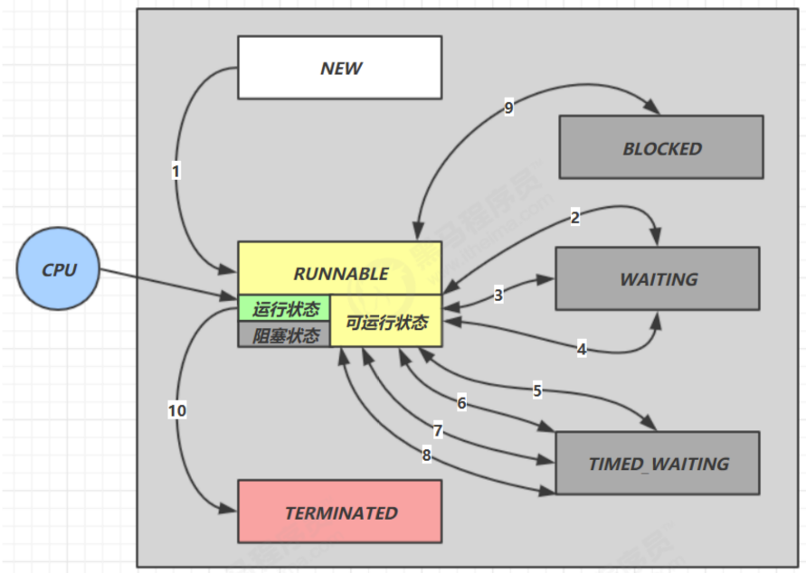

## 线程状态转换

假设有线程`Thread t`

#### 情况1 NEW --> RUNNABLE
* 当调用`t.start()`方法时，由`NEW` --> `RUNNABLE`

#### 情况2 RUNNABLE <--> WAITING
* t线程用`synchronized(obj)`获取了对象锁后
  * 调用`obj.wait()`方法时，t线程从`RUNNABLE` --> `WAITING`
  * 调用`obj.notify()`方法、`obj.notifyAll()`或者`t.interrupt()`时
    * 竞争锁成功，t线程从`WAITING` --> `RUNNABLE`
    * 竞争锁失败，t线程从`WAITING` --> `BLOCKED`

#### 情况3 RUNNABLE <--> WAITING
* **当前线程** 调用`t.join()`方法时，**当前线程** 从`RUNNABLE` --> `WAITING`
  * 注意是**当前线程**在t线程对象的Monitor上等待
* t线程运行结束，或调用了**当前线程**的`interrupt()`时，**当前线程**从`WAITING` --> `RUNNABLE`

#### 情况4 RUNNABLE <--> WAITING
* 当前线程调用`LockSupport.park()`方法会让当前线程从`RUNNABLE` --> `WAITING`
* 调用`LockSupport.unpark(目标线程)`方法或调用了线程的`interrupt()`，会让目标线程从`WAITING` --> `RUNNABLE`

#### 情况5 RUNNABLE <--> TIMED_WAITING
* t线程调用了`synchronized(obj)`获取了对象后
  * 调用`obj.wait(long n)`方法时，t线程从`RUNNABLE` --> `TIMED_WAITING`
  * t线程等待时间超过了n ms，或调用`obj.notify()`，`obj.notifyAll()`或者`t.interrupt()`时，
      * 竞争锁成功，t线程从`TIMED_WAITING` --> `RUNNABLE`
      * 竞争锁失败，t线程从`TIMED_WAITING` --> `BLOCKED`

#### 情况6 RUNNABLE <--> TIMED_WAITING
* **当前线程** 调用`t.join(long n)`方法时，**当前线程** 从`RUNNABLE` --> `TIMED_WAITING`
    * 注意是**当前线程**在t线程对象的Monitor上(EntryList)等待
* **当前线程**等待时间超过了n ms，t线程运行结束，或调用了**当前线程**的`interrupt()`时，**当前线程**从`TIMED_WAITING` --> `RUNNABLE`

#### 情况7 RUNNABLE <--> TIMED_WAITING
* 当前线程调用`Thread.sleep(long n)`，当前线程从`RUNNABLE` --> `TIMED_WAITING`
* **当前线程** 等待时间超过了n ms，当前线程从 `TIMED_WAITING` --> `RUNNABLE`

#### 情况8 RUNNABLE <--> TIMED_WAITING
* 当前线程调用 `LockSupport.parkNanos(long nanos)` 或 `LockSupport.parkUntil(long millis)` 时，**当前线程** 从 `RUNNABLE`--> `TIMED_WAITING`
* 调用 `LockSupport.unpark(目标线程)` 或调用了线程 的 `interrupt()` ，或是等待超时，会让目标线程从
`TIMED_WAITING`--> `RUNNABLE`

#### 情况9 RUNNABLE <--> TIMED_WAITING
* **t 线程** 用 synchronized(obj) 获取了对象锁时如果竞争失败，从 `RUNNABLE` --> `BLOCKED`
* 持 obj 锁线程的同步代码块执行完毕，会唤醒该对象上所有 `BLOCKED` 的线程重新竞争，如果其中 t 线程竞争
成功，从 `BLOCKED` --> `RUNNABLE` ，其它失败的线程仍然 `BLOCKED`

#### RUNNABLE <--> TERMINATED
当前线程所有代码运行完毕，进入 `TERMINATED`